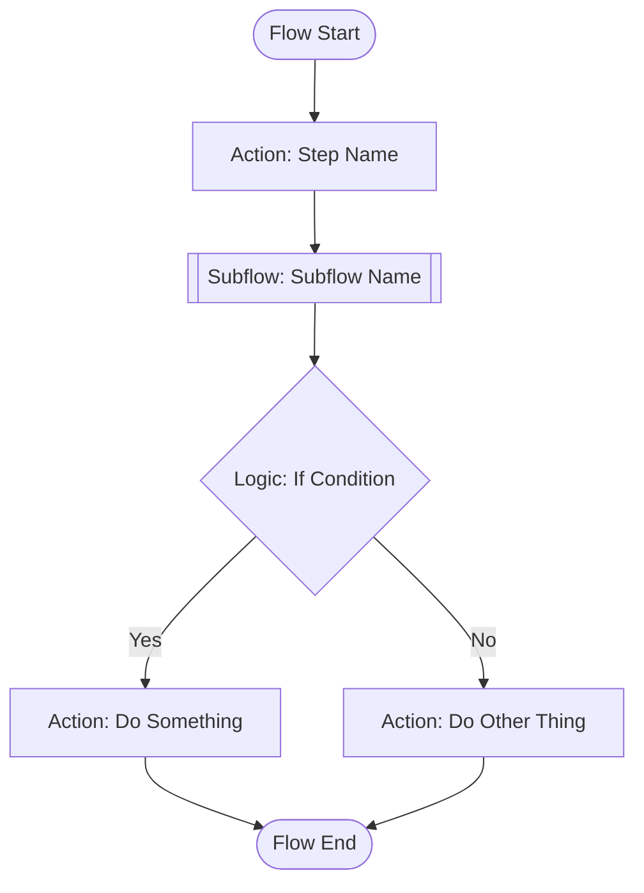
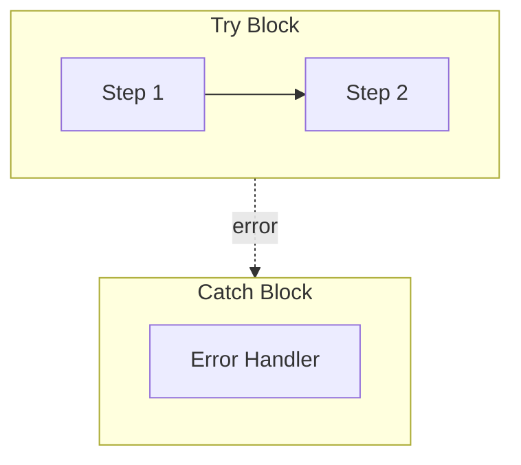
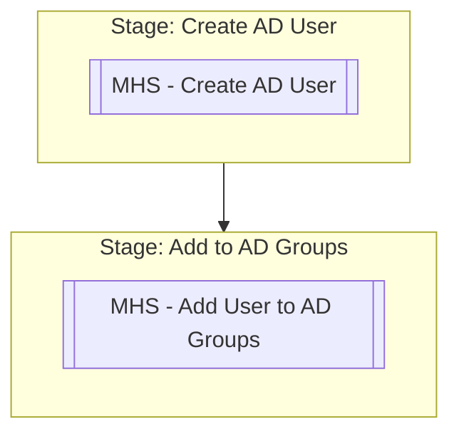
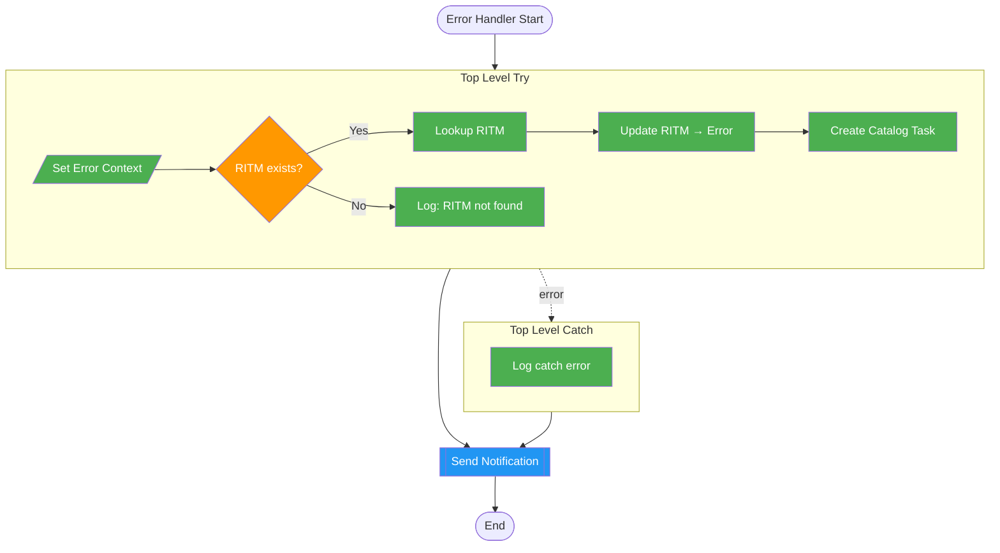

# Visual Diagrams

## Mermaid Flowchart Generation

After fetching flow steps, generate a Mermaid diagram to visualize the flow structure.

## Basic Pattern



## Node Shape Conventions

| Step Type | Mermaid Shape | Example |
|-----------|--------------|---------|
| Start/End | `([text])` | `Start([Flow Start])` |
| Action | `[text]` | `Step1[Create AD User]` |
| Subflow | `[[text]]` | `Step2[[MHS - Create AD User]]` |
| Logic (If/Decision) | `{text}` | `Step3{User has manager?}` |
| Set Variables | `[/text/]` | `Step4[/Set Flow Variables/]` |
| Error/Catch | `[text]:::error` | `Catch[Error Handler]:::error` |

## Style Classes

```mermaid
flowchart TD
    classDef action fill:#4CAF50,color:white
    classDef subflow fill:#2196F3,color:white
    classDef logic fill:#FF9800,color:white
    classDef error fill:#f44336,color:white
    classDef stage fill:#9C27B0,color:white
```

## Building from Flow Data

### Algorithm

1. Sort all steps by `order` field
2. For each step, determine node shape by type (action/subflow/logic)
3. Use `parent_ui_id` to determine nesting:
   - Steps with same `parent_ui_id` are siblings
   - Logic blocks (If/Else) create branching
4. Connect sequential steps with arrows
5. Connect If → Yes/No branches

### Handling Try/Catch



### Handling Stages

Use Mermaid subgraphs for stages:



## Simplification Strategies

For complex flows with 30+ steps, consider:

1. **Stage-level view** — Show only stages as boxes, hide internal steps
2. **Happy path only** — Show main flow without error handling branches
3. **Collapsed subflows** — Show subflow as single node, expand only on request
4. **Top-level only** — Skip steps nested inside Try/Catch/If blocks

## Example: Error Handler Flow


